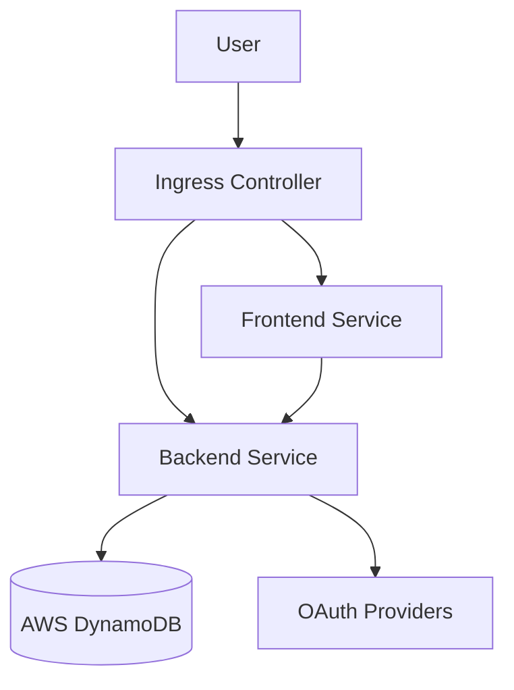

# 🌊 Biomarine AI

Biomarine AI is a cutting-edge platform designed to revolutionize marine biology research through Artificial Intelligence. It provides tools for automated species classification, otolith analysis, and collaborative research data management.


## 🚀 Features

- **AI-Powered Analysis**: Automated classification of marine species and otolith age estimation using TensorFlow.js.
- **Research Dashboard**: Comprehensive analytics and visualization of research data.
- **Data Management**: Secure upload and management of research datasets.
- **Collaboration Tools**: Connect with other researchers and share findings.
- **Interactive Maps**: Visual distribution of marine species across the Indian Ocean.
- **Secure Authentication**: Multi-method login support (Email, Google, LinkedIn).

## 🛠️ Tech Stack

### Frontend
- **Framework**: React 19 (Vite)
- **Styling**: Tailwind CSS v4
- **State Management**: React Context & TanStack Query
- **Visualization**: Recharts, Framer Motion
- **AI Integration**: TensorFlow.js
- **Maps**: Interactive mapping components

### Backend
- **Runtime**: Node.js & Express
- **Database**: AWS DynamoDB (NoSQL)
- **Authentication**: Passport.js (JWT, OAuth2)
- **Validation**: Joi
- **Security**: Helmet, CORS, Bcrypt

### DevOps & Infrastructure
- **Cloud Provider**: AWS (Amazon Web Services)
- **Containerization**: Docker
- **Orchestration**: Kubernetes (Amazon EKS)
- **IaC**: Terraform
- **CI/CD**: GitHub Actions & ArgoCD
- **Registry**: Amazon ECR

## 🏁 Getting Started

### Prerequisites
- Node.js (v18+)
- Docker & Docker Compose
- AWS Account (for cloud deployment)
- Terraform (for infrastructure provisioning)

### Local Development Setup

1. **Clone the repository**
   ```bash
   git clone https://github.com/AyushChoudhary6/biomarine-ai.git
   cd biomarine-ai
   ```

2. **Environment Configuration**
   Create a `.env` file in the root directory (see `env.example`):
   ```env
   AWS_ACCESS_KEY_ID=your_access_key
   AWS_SECRET_ACCESS_KEY=your_secret_key
   AWS_REGION=us-west-2
   JWT_SECRET=your_jwt_secret
   ```

3. **Run with Docker Compose (Recommended)**
   This starts the frontend, backend, and a DynamoDB setup container.
   ```bash
   docker-compose up --build
   ```

4. **Manual Setup**
   
   *Backend:*
   ```bash
   cd backend
   npm install
   npm run setup-db # Initialize DynamoDB tables
   npm start
   ```

   *Frontend:*
   ```bash
   cd ..
   npm install
   npm run dev
   ```

   Access the application at `http://localhost:5173`.

## 🏗️ Architecture

The application follows a microservices-ready architecture deployed on Kubernetes:



## 🔧 DevOps & Deployment Deep Dive

This project implements a robust, production-grade DevOps pipeline following **GitOps** principles.

### 1. Infrastructure as Code (Terraform)
Located in the `terraform/` directory, our IaC setup provisions the entire AWS environment:

- **VPC Module**: Creates a secure network environment with public/private subnets across multiple Availability Zones (AZs) for high availability.
- **EKS Module**: Provisions a managed Kubernetes cluster (`biomarine-ai`) with managed node groups.
- **ECR Repositories**: Creates secure Docker registries for `biomarine-frontend` and `biomarine-backend` with lifecycle policies to manage image retention.
- **IAM & Security**: Sets up OIDC providers for GitHub Actions (passwordless auth) and IRSA (IAM Roles for Service Accounts) to grant pods granular access to AWS services like DynamoDB.

### 2. CI/CD Pipeline Architecture

Our pipeline is split into **Continuous Integration (CI)** via GitHub Actions and **Continuous Deployment (CD)** via ArgoCD.

#### Continuous Integration (GitHub Actions)
Workflow file: `.github/workflows/ci-cd.yml`

1. **Trigger**: Pushes to `main` or `DevOps` branches.
2. **Test**: Runs unit tests and linting for both frontend and backend.
3. **Build**:
   - Builds optimized Docker images for frontend and backend.
   - Tags images with the commit SHA and `latest`.
4. **Push**: Authenticates with AWS ECR using OIDC (secure, temporary credentials) and pushes the images.
5. **Manifest Update**:
   - Automatically updates the Kubernetes deployment manifests (`K8/backend-deployment.yaml`, etc.) with the new image tags.
   - Commits these changes back to the repository.

#### Continuous Deployment (ArgoCD)
We use the **GitOps** pattern where the Git repository is the "source of truth".

1. **Sync**: ArgoCD, running inside the EKS cluster, monitors the `K8/` directory of the repository.
2. **Detect**: When GitHub Actions updates the image tags in the manifests, ArgoCD detects the drift between the live cluster state and the Git state.
3. **Apply**: ArgoCD automatically syncs the changes, performing a rolling update of the pods.
   - **Self-Healing**: If manual changes are made to the cluster that conflict with Git, ArgoCD automatically reverts them.
   - **Visualization**: Provides a UI to visualize the application topology and deployment status.

### 3. Kubernetes Configuration (`K8/`)

- **Deployments**: Defines the desired state for frontend and backend pods, including replica counts, resource limits, and liveness/readiness probes.
- **Services**: Exposes pods internally using `ClusterIP`.
- **Ingress**: Manages external access to the services (Load Balancing).
- **ConfigMaps & Secrets**: Decouples configuration from container images. Secrets are managed securely (e.g., via AWS Secrets Manager or sealed secrets in production).

### 4. Security Measures

- **OIDC Authentication**: GitHub Actions authenticates to AWS without storing long-lived access keys.
- **Least Privilege**: IAM roles are scoped strictly to required permissions (e.g., only DynamoDB access for backend pods).
- **Network Isolation**: Database and backend services run in private subnets; only the Load Balancer is public.
- **Image Scanning**: ECR is configured to scan images for vulnerabilities on push.

## 📂 Project Structure

```
biomarine-ai/
├── .github/workflows/   # CI/CD Pipeline definitions
├── argocd/              # ArgoCD application manifests
├── aws/                 # AWS specific scripts and docs
├── backend/             # Node.js/Express API
│   ├── config/          # DB and App configuration
│   ├── controllers/     # Request handlers
│   ├── models/          # Data models (User, Research)
│   └── routes/          # API endpoints
├── K8/                  # Kubernetes manifests (Deployments, Services)
├── public/              # Static assets
├── src/                 # React Frontend
│   ├── components/      # Reusable UI components
│   ├── contexts/        # Global state (Auth, Theme)
│   ├── pages/           # Application views
│   └── utils/           # Helper functions & AI models
├── terraform/           # Infrastructure as Code
└── docker-compose.yml   # Local development orchestration
```

## 🤝 Contributing

1. Fork the repository
2. Create your feature branch (`git checkout -b feature/AmazingFeature`)
3. Commit your changes (`git commit -m 'Add some AmazingFeature'`)
4. Push to the branch (`git push origin feature/AmazingFeature`)
5. Open a Pull Request

## 📄 License

This project is licensed under the MIT License - see the LICENSE file for details.
